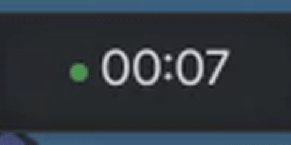
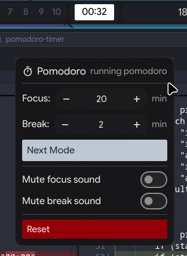
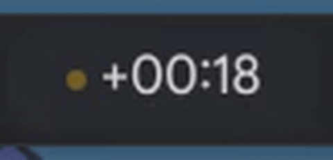
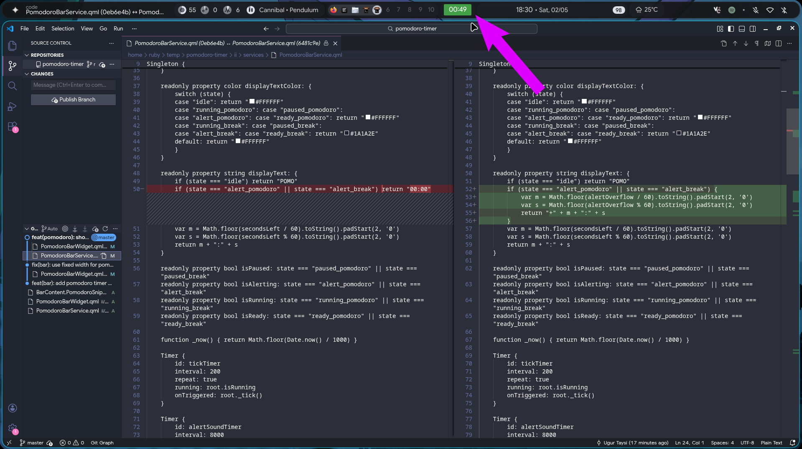

# Illogical Impulse Pomodoro

A Pomodoro timer widget for the [Illogical Impulse](https://github.com/end-4/dots-hyprland) Quickshell bar, with configurable focus/break durations, pause-resume, sound alerts, and a right-click popup menu.

<table align="center">
  <tr>
    <td align="center">
      <br/>
      <sub>Timer</sub>
    </td>
    <td align="center" rowspan="2">
      <br/>
      <sub>Menu</sub>
    </td>
  </tr>
  <tr>
    <td align="center">
      <br/>
      <sub>Overtime</sub>
    </td>
  </tr>
  <tr>
    <td colspan="2" align="center">
      <br/>
      <sub>Fullscreen Overview</sub>
    </td>
  </tr>
</table>

## Requirements

- [Illogical Impulse](https://github.com/end-4/dots-hyprland) — the widget depends on its modules and widgets (`Appearance`, `Config`, `Translation`, `StyledText`, `RippleButton`, `StyledSpinBox`, `StyledSwitch`, `BarGroup`, etc.)

## Installation

Copy the files into your Illogical Impulse config directory, preserving the `ii/` paths:

```
ii/modules/ii/bar/BarContent.PomodoroSnippet.qml
ii/modules/ii/bar/PomodoroBarWidget.qml
ii/services/PomodoroBarService.qml
```

Then insert the snippet from `BarContent.PomodoroSnippet.qml` into your `BarContent.qml` at the desired position.

Add timer durations to your config options (defaults shown):

```json
"time": {
  "pomodoro": {
    "focus": 1500,
    "breakTime": 300
  }
}
```

Values are in seconds (`1500` = 25 min, `300` = 5 min).

## Controls

| Action | Input | Effect |
|--------|-------|--------|
| Start focus | Left-click from **idle** / **ready** | Begins focus countdown |
| Start break | Left-click from **ready break** | Begins break countdown |
| Pause | Left-click while **running** | Pauses the timer |
| Resume | Left-click while **paused** | Resumes from where it left off |
| Dismiss alert | Left-click or right-click while **alerting** | Advances to the next mode (focus → break or break → focus) |
| Open menu | Right-click | Opens the popup menu |
| Close menu | Click outside / right-click again | Closes the popup menu |
| Next mode | Popup → **Next Mode** button | Skips to the opposite phase |
| Reset | Popup → **Reset** button | Returns to idle state |
| Adjust focus duration | Popup → **Focus** spinbox | Sets focus length (1–120 min) |
| Adjust break duration | Popup → **Break** spinbox | Sets break length (1–60 min) |
| Mute focus sound | Popup → **Mute focus sound** toggle | Silences the focus-completion alert |
| Mute break sound | Popup → **Mute break sound** toggle | Silences the break-completion alert |

When a timer ends, the badge flashes and plays a sound. Overflow time displays as `+MM:SS` so you can see how long you've been past the timer.